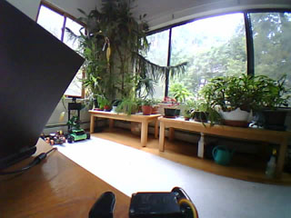
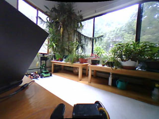

# vid_ocv
## Background Framegrabbing with Rectification

This C++ library performs framegrabbing from a camera (or web stream) in a background thread to keep the main process from being slowed down. It works with Windows ([.dll](../project/vid_ocv.dll)) or Linux ([.so](../project/bin/ARM64/Release/libvid_ocv.so)) and there are Python bindings if desired. When capturing images it can automatically de-warp them using intrinsic parameters as well as de-rotate them (an extrinsic parameter). 

| original curvy | straightened |
| --- | --- |
|  |  |

In addition, there are some simple display functions with image save and video save options. This project was originally developed for the [Baijiu](https://github.com/jconnell11/Baijiu) robot and is used by the test programs for the [dude_trk](https://github.com/jconnell11/dude_trk) person tracker and [rng_flr](https://github.com/jconnell11/rng_flr) depth map generator. Note that it requires the opencv_world4100 library, but the machine itself does not have to have OpenCV installed. 

---

### Test Program

First, copy all these files to some local directory then open a command prompt and "cd" to the directory. The [vid_test](../project/vid_test.exe) executable defaults to capturing from the web stream camera on the Baijiu robot. To instead grab from a local camera, supply the additional argument "0". That is, on a Windows Terminal do the following:

    vid_test 0

Equivalently, for Linux copy the [executable](../project/bin/ARM64/Release/vid_test) to the main directory then, at the command prompt, do:

    ./vid_test 0

This should pop up a window showing you a live camera view. Note that, when using a numbered camera, de-warping is disabled in the test program. Check out the [source](../project/vid_test.cpp) for this demo to see how a lot of the functions work.

### Framegrabbing

The [header file](../project/vid_ocv.h) documents the various functions available. Start by specifying the source with __ocv_open__ or __ocv_cam__, then get a pointer to a frame buffer with __ocv_get__. The framebuffer is a collection of unsigned 8 bit integers in BGR color order scanned left-to-right but _bottom-up_. This is the Windows standard (where this library is mostly used) as opposed to the OpenCV convention of top-down. Note that ocv_get has an option of flipping the image upside down for direct use with OpenCV. Generally, you can turn the buffer into a normal Mat using code like this (perhaps followed by a call to cv::flip):

    img = cv::Mat(480, 640, CV_8UC3, (void *) buf);

However, this is _not necessary_ when using the provided display function (it expects bottom-up buffers).

### De-Warping

The __ocv_warp__ function takes standard OpenCV radial distortion parameters. In addition you can supply an angle (in degrees) to rotate the image. Finally, there is an overall magnification factor. Setting this less than one (e.g. 0.8) shows you more detail in the corners but results in bigger blank regions (black). Note that the effective focal length of a image with some magnification is _mag * f_ for subsequent realworld geometric calculations.

You can obtain the warping coefficients for your camera by the normal OpenCV method of showing it a checkboard pattern at various positions. I download this 9x6 [pattern](checker_9x6.pdf) and display it fullscreen on my old IPad Air. Generally, you need to take a ruler and measure the size of a square on whatever device (or printout) you are using, then enter it at the top of the [wifi_corners](../project/scripts/wifi_corners.py) script file. 

Next, make a subdirectory "images" and run [wifi-images](../project/scripts/wifi_images.py) to collect 10-20 sample images. Move the pattern around so it alternately covers the whole image and each of the corners. All the intersections one level in need to be visible (the outer border can be clipped). Hit the "S" key to save each image.

    py wifi_images.py
    py wifi_corners.py

After this, run wifi_corners and use the numbers it prints out as values for the ocv_warp function.

### Displaying and Saving

To display an image you basically make a window with __ocv_win__, send the current image to it with __ocv_queue__, then call __ocv_show__ to refresh all windows. You can make multiple windows (up to 6), queue new images to all of them, then call ocv_show just once for the collection (blocks briefly). Note that the arguments of ocv_win let you title each window and change its placement on the screen. All displayed images are assumed to be in color (as produced by ocv_get).

There are several options for saving program output. One is the "mark" argument of ocv_queue. If this is set to a positive number then it will immediately save that image out as a BMP bitmap file. Alternatively, you can capture the whole run of a program by setting the "rec" argument of ocv_win to 1. This records an MP4 video of what was displayed on that window. You can find any images or videos that were produced in subdirectory "rec" (which must already exist before running your program).

### Compiling

If for some reason you want to recompile this library, the project files for [Visual C++ 2022](https://aka.ms/vs/17/release/vs_community.exe) Community (free) are included. Use vid_ocv.sln for Windows, or vid_ocv_ix.sln for Linux. The Linux version assumes you can connect to some remote machine with G++ and OpenCV 4.10 installed to do the compiling. The test program has similar solution files: vid_test.sln and vid_test_ix.sln.

October 2026 - Jonathan Connell - jconnell@alum.mit.edu